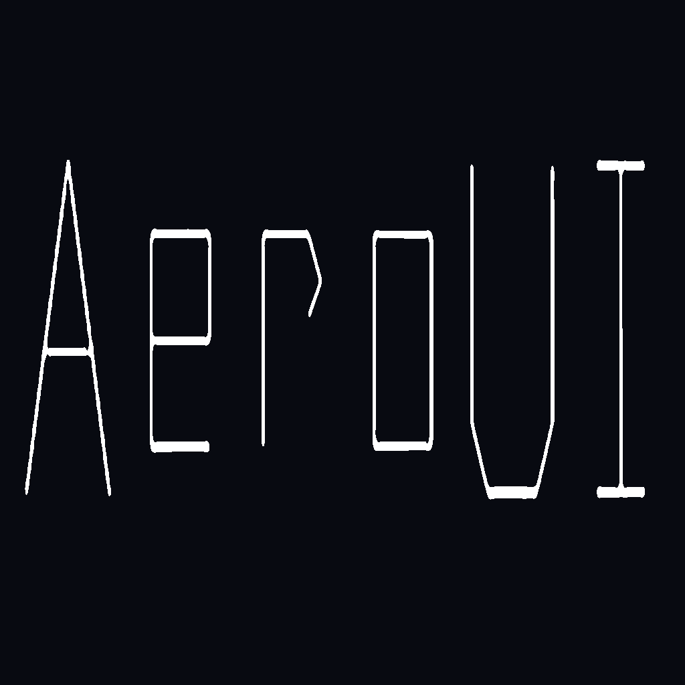

<p align="center">
  <a href="https://aero-ui.zeroc.top">
    
  </a>
</p>

<h1 align="center">AeroUI</h1>

<p align="center">A React component library designed for AI collaboration and effortless interface building.</p>

<p align="center">
  <a href="https://npmjs.org/package/aeroui"></a>
  <a href="https://npmjs.org/package/aeroui"></a>
  <a href="https://github.com/name-q/aeroui/blob/main/LICENSE"></a>
</p>

<p align="center">
  <a href="https://aero-ui.zeroc.top">Documentation</a> · <a href="https://aero-ui.zeroc.top/cn">中文文档</a> · <a href="https://aero-ui.zeroc.top/guide/ai-workflow">AI Workflow Guide</a>
</p>

---

## Features

- **Pencil Support** — Built-in `.pen` design file with 91 reusable components. AI reads the design and generates React code directly.
- **60+ Components** — From Form to Table, Modal to Masonry — a comprehensive toolkit for production interfaces.
- **AI-Friendly** — Consistent API patterns (`value`/`onChange`, `open`/`onOpenChange`, `size`, `disabled`) so AI can predict usage across all components.
- **Themeable** — CSS Variables + `ConfigProvider` for runtime theme switching. Dark mode built-in.
- **i18n Ready** — Built-in English and Chinese locale packs, easily extensible.
- **Lightweight** — Tree-shakeable ESM exports, zero runtime CSS-in-JS. Less + CSS Variables keep the bundle lean.

## Install

```bash
pnpm i aeroui lucide-react
```

Vite projects also need Less:

```bash
pnpm i -D less
```

## Quick Start

```tsx
import { Button, Input, ConfigProvider } from 'aeroui';

export default () => (
  <ConfigProvider>
    <Input placeholder="Enter something" />
    <Button type="primary">Submit</Button>
  </ConfigProvider>
);
```

No global CSS import needed — styles are injected automatically when your bundler processes the component Less files.

## AI Workflow with Pencil

AeroUI ships with an `AeroUi.pen` design file containing all components as reusable design elements. In an IDE with Pencil MCP support:

1. **Open** `AeroUi.pen` in your editor
2. **Ask AI** to design a page using the components
3. **Iterate** on the design visually
4. **Ask AI** to read the design and generate React code with AeroUI

See the [AI Workflow Guide](https://aero-ui.zeroc.top/guide/ai-workflow) for details.

## Theming

```tsx
import { ConfigProvider } from 'aeroui';

<ConfigProvider
  theme={{ 'primary-color': '#7c3aed' }}
  size="small"
>
  <App />
</ConfigProvider>
Toggle dark mode:

```ts
document.documentElement.setAttribute('data-theme', 'dark');
```

## Internationalization

```tsx
import { ConfigProvider, enUS, zhCN } from 'aeroui';

<ConfigProvider locale={enUS}>
  <App />
</ConfigProvider>
```

## Mock Server

The `server/` directory contains a local Koa server for testing file upload demos. To start it:

```bash
cd server && node index.js
```

This launches a mock backend on `http://localhost:3001` that handles upload requests for the Upload component demos.

## Links

- [Documentation](https://aero-ui.zeroc.top)
- [AI Workflow Guide](https://aero-ui.zeroc.top/guide/ai-workflow)
- [GitHub](https://github.com/name-q/aeroui)

## License

[MIT](./LICENSE)
